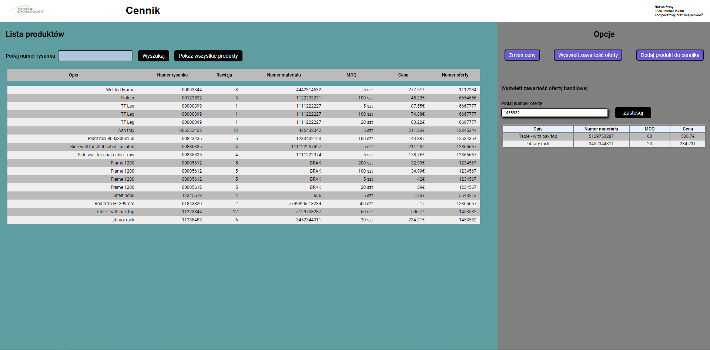

<div position="center">



</div>

# Pricebook App - BackEnd

## Wstęp - opis

Hej! Pricebook to prosty cennik dla firm zajmujących się produkcją elementów stalowych.<br> Aplikację stworzyłem na własne potrzeby zawodowe, do szybkiej idendyfikacji cen produktów na podstawie numeru rysunku technniczego.
<br>Powinna się sprawdzić nie tylko w przypadku mojego pracodawcy, ale także w innych przedsiębiorstwach zajmujących się szeroko rozumianą obróbką stali.
Główne funcjonalności:
- wyświetlanie zawartości cennika,
- wyszukiwanie rekordów po numerze rysunku,
- dodawanie nowych produktów do cennika,
- globalna zmiana cen na podstawie wskazanej podwyżki/obniżki procentowej,
- wyświetlanie zawartości oferty handlowej,


## Demo

Dostępne wkrótce

[comment]: <> ([![IMAGE ALT TEXT HERE]&#40;https://raw.githubusercontent.com/RadekJ87/OfferGenerator/main/public/assets/images/readme_img.PNG&#41;]&#40;https://youtu.be/yL0xIbkTV5w&#41;)

## Technologia

<div display="flex" flex-direction="row" align-items="center">
 


</div>


## Dodatkowe paczki + wersja
### Dependencies
- cors 2.8.5,
- express 4.18.1,
- express-async-errors 3.1.1,
- express-rate-limit 6.4.0,
- mysql2 2.3.3,
- uuid 8.3.2.

### DevDependencies

- @types/cors 2.8.12,
- @types/express 4.17.13,
- @types/jest 28.1.4,
- @types/node 18.0.0,
- @types/uuid 8.3.4,
- jest 28.1.2,
- react-app-rewired 2.2.1,
- ts-jest 28.0.5,
- ts-node 10.8.1,
- ts-node-dev 2.0.0,
- typescript 4.7.4.

## Instalacja

```bash
$ npm install
```


## Uruchamianie


```bash
# development mode
$ npm run start

# watch mode
$ npm run start:dev
```
